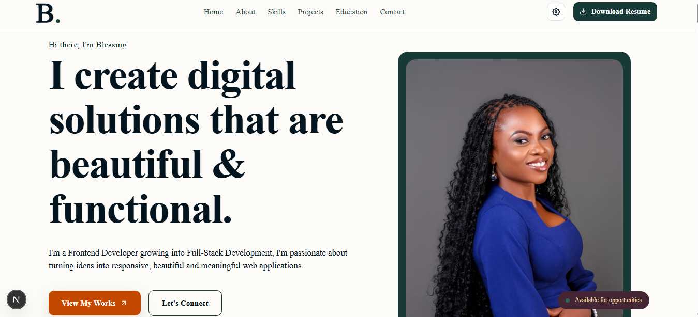

# Blessing Ehi Ocheme's Portfolio project

Welcome to my portfolio, a modern, responsive developer portfolio built with **Next.js, React, CSS Modules, and modern web development practices**.

This portfolio showcases my journey from UI/UX basics and frontend development into full-stack development, including selected projects, technical skills, case studies, education, certificates, and contact information.

## Live Website

**Live Portfolio:** (https://blessing-portfolio-vl2.vercel.app/)

**GitHub Repository:** https://github.com/Ehibliss/Blessing-s-Portfolio-V2.gitportfolio

## About The Project

This portfolio was designed and developed as a personal platform to showcase my skills, projects, education, and continuous growth as a developer.

I wanted the portfolio to be more than a collection of project screenshots. The goal was to create an experience that communicates:

- Who I am
- What I build
- How I approach problems
- What technologies I work with
- What I am currently learning
- My transition from frontend development into full-stack development

This project was built from scratch using Next.js and React with a strong focus on responsive design, reusable components, accessibility, maintainability, and visual interaction.

# Features

## Modern UI Design

The portfolio uses a clean and modern visual system with a custom color palette built around:

- Deep Teal / Green
- Burnt Orange
- Cream
- Dark backgrounds
- Light backgrounds

The colors are managed using CSS variables so that the design can easily adapt between themes.

## Dark & Light Mode

The portfolio supports both dark and light themes.

The theme system is built around reusable CSS variables, allowing colors, backgrounds, borders, shadows, and text colors to change depending on the active theme.

This makes the portfolio comfortable to browse in different environments while maintaining the same visual identity.

## Responsive Navigation

The navigation is designed to work across:

- Desktop
- Tablet
- Mobile

It provides quick access to the major sections of the portfolio and supports smooth navigation throughout the page.

## Hero Section

The hero section introduces me and provides visitors with an immediate understanding of:

- My role
- My development focus
- My current direction
- My availability for opportunities

The section also includes interactive visual elements and calls-to-action.

## About Section

The About section provides more context about my background, development journey, and approach to building digital products.

It focuses on the transition from design and frontend development toward full-stack development.

## Skills Section

The Skills section highlights the technologies and tools I currently work with.

### Frontend

- HTML
- CSS
- JavaScript
- React
- Next.js

### Backend

- Node.js
- Express.js
- MongoDB
- Mongoose
- REST APIs

### Tools

- Git
- GitHub
- VS Code
- Postman
- MongoDB Compass
- Vercel
- Netlify

The skills section is designed to communicate both current strengths and technologies I am actively developing.

---

# Projects

The Projects section showcases selected projects that demonstrate my practical development experience.

Each project focuses on a specific problem, technology, or development skill.

### Featured Projects

#### HubSpot Clone

A frontend recreation inspired by the HubSpot website.

**Technologies:**

- React
- JavaScript
- CSS
- React Icons

**Focus:**

- Responsive UI
- Component architecture
- Navigation
- Layout systems
- Interactive sections
- Reusable components

#### Bliss Magicfingers

A salon management and booking application created for my braiding business concept.

The project goes beyond a static frontend and includes backend functionality.

**Technologies:**

- Next.js
- React
- Node.js
- MongoDB
- Mongoose
- REST APIs

**Features include:**

- Service management
- Booking functionality
- API endpoints
- MongoDB database
- CRUD operations
- Backend validation
- Responsive interface

This project is particularly important to my development journey because it allowed me to begin connecting frontend interfaces with backend services and databases.

#### Animal Gallery

A responsive gallery project focused on presenting visual content in a clean grid-based interface.

**Focus:**

- Responsive layouts
- CSS Grid
- Image presentation
- Component-based development
- User interaction

---

#### Previous Portfolio

An earlier version of my personal portfolio, originally developed and hosted on Netlify.

This project demonstrates the progression of my development skills and design approach over time.

---

# Case Studies

The portfolio includes a dedicated Case Studies section.

Instead of simply displaying screenshots, this case studies explain the development process behind selected projects.

Each case study can cover:

1. Project overview
2. Problem
3. Goals
4. Research
5. Design decisions
6. Development process
7. Technologies used
8. Challenges
9. Solutions
10. Final result
11. Lessons learned

This allows visitors and recruiters to understand not only **what I built**, but also **how I think and solve problems**.

# Education & Credentials

The Education section presents both my academic background and technical training.

### Education

**B.Sc. Business Administration**

National Open University of Nigeria

2022 to 2026

My academic background gives me additional knowledge in areas such as:

- Business
- Communication
- Problem solving
- Management
- Organization
- Working with people

### Technical Training

**Frontend Development — TS Academy**

2026

Practical training focused on frontend development and building responsive web applications.

# Contact Section

The portfolio includes a contact section where visitors can:

- Send a message
- Contact me through email
- Visit my GitHub
- Visit my LinkedIn

The contact form is designed to provide a simple way for recruiters, clients, and collaborators to get in touch.

# Footer

The footer provides:

- Quick navigation
- Social links
- Email contact
- Copyright information
- Back-to-top functionality

# Animations & Interactions

The portfolio uses subtle animations to make the experience more engaging without overwhelming the user.

Examples include:

- Hover effects
- Button transitions
- Card interactions
- Image scaling
- Navigation interactions
- Floating elements
- Scroll-based visual effects

The animations are intentionally kept subtle so that usability remains the priority.

# Thankyou for visiting my portpolio.......... the end...

"# Blessing-s-Portfolio-V2"
